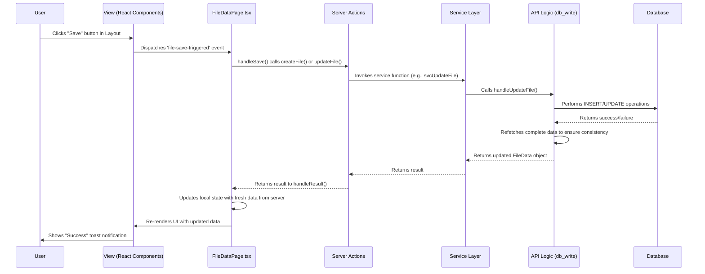

# Patient File Process Documentation

## 1. Introduction

This document serves as a comprehensive guide to the patient file management system within the DigiFile application. Its purpose is to provide a single source of truth for developers and AI agents, explaining the core concepts, user workflows, and technical implementation of creating, managing, and interacting with patient files.

A developer or agent should be able to use this document to understand the system's architecture and data flow, enabling them to build new features or fix bugs effectively without needing constant re-explanation.

## 2. Core Concepts

### The "File" vs. The "Patient"

It is crucial to understand the distinction between a `File` and a `Patient`:

- **Patient**: Represents a unique individual. The `patient` table in the database stores their demographic information (name, ID number, date of birth, contact details, etc.). A single patient can exist without any files associated with them.
- **File**: Represents a specific case, episode of care, or administrative record for a patient. The `file_info` table stores this information. A file is always linked to at least one patient.

A patient can have multiple files. For example, a visit for a foot injury could be one file, and a visit for the flu next month could be a new, separate file, even though both link to the same patient record. This allows for episodic tracking of care and billing.

### The `FileData` Object

The cornerstone of the client-side implementation is the `FileData` object, defined in `app/types/file-data.ts`. When a user navigates to a file's page (`/sites/file-data/[uid]`), the application fetches all related data from the server and constructs a large, nested `FileData` object. This object is then held in the React state of the `FileDataPage` component.

This in-memory object acts as a "draft" or "working copy." All user interactions—editing patient details, adding notes, changing medical aid information—manipulate this single state object. The data is only persisted to the database when the user clicks the "Save" button.

A simplified structure of the `FileData` object looks like this:

```typescript
interface FileData {
  uid?: string;
  file_number?: string;
  account_number?: string;
  patient?: Patient; // Details of the primary patient
  medical_cover?: {
    type?: 'medical-aid' | 'injury-on-duty' | 'private';
    medical_aid?: MedicalAid;
    member?: Member; // Details of the main member if different from patient
    injury_on_duty?: InjuryOnDuty;
  };
  notes?: {
    file_notes?: FileNote[];
    clinical_notes?: FileNote[];
  };
  // ... and other properties
}
```

## 3. User Workflows & Use Cases

### A. Standard New File Creation (Receptionist Workflow)

1.  **Initiation**: The user clicks the "Create New" button on the file list page (`/sites/file-data`).
2.  **Navigation**: They are redirected to `/sites/file-data/new-record`.
3.  **Client-Side**: The `FileDataPage` component initializes a blank `FileData` object, pre-populated with a new unique `file_number` and `account_number`.
4.  **Data Entry**: The receptionist fills in the patient's details (ID number, name, etc.), medical cover information, and other relevant data. The `FileData` state object is updated on every input change.
    - _Smart Feature_: When the South African ID number is entered, the date of birth and gender are automatically extracted and populated.
    - _Smart Feature_: When the patient's name and surname are entered, their initials are auto-generated.
5.  **Saving**: The receptionist clicks "Save."
6.  **Backend Process**:
    - The `handleSave` function in `FileDataPage` calls the `createFile` server action.
    - This action triggers the API endpoint which executes `handleCreateFile` in `app/api/files/[uid]/db_write.ts`.
    - This function creates new records in the `file_info`, `patient`, and `fileinfo_patient` tables, along with any medical aid or other related data.
7.  **Redirect**: After a successful save, the user is redirected from `/new-record` to the newly created file's URL, `/sites/file-data/[newly_created_uid]`.

### B. Doctor's Workflow (Adding Clinical Information)

1.  **Access**: The doctor opens an existing file from the file list.
2.  **Data Loading**: The `FileDataPage` component fetches all data for the given file UID and populates the `FileData` state object.
3.  **Adding Notes**: The doctor navigates to the "Clinical Notes" tab within the `NotesSection` component.
4.  **Create Note**: They click "Add New Note," which opens a dialog. Here they can enter text, set a timestamp, and attach documents/images. Attachments are handled by uploading them to Supabase Storage.
5.  **Viewing Attachments**: After a note with attachments is saved, the attachments are displayed as clickable badges. Clicking on a badge opens a preview modal (`AttachmentPreviewModal.tsx`). The system generates a secure, temporary URL to display the content. Images and PDFs are rendered directly within the modal, while other file types are offered as a download.
6.  **Saving Note**: On saving the note, the `saveNewNote` function in `NotesSection.tsx` is called. It uses either the `createNoteWithFiles` (if a patient link exists) or the `createNoteSmart` server action. The new note is added to the `notes.clinical_notes` array in the main `FileData` state object, and the UI re-renders.
7.  **Saving File**: Any other changes made to the file are persisted only when the main "Save" button in the layout is clicked.

### C. Emergency/Quick File Creation (Doctor Workflow)

This workflow addresses the need for a doctor to create a file quickly with minimal information, for example, for an unconscious patient in a hospital.

1.  **Initiation**: The doctor opens `/sites/file-data/new-record` on a mobile device.
2.  **Minimal Data Entry**:
    - The doctor can leave most patient details blank.
    - Crucially, they can proceed **without a patient ID number**.
    - They can add a note (e.g., "Patient from car accident, Ward B") and attach a photo of the patient or their temporary hospital bracelet.
3.  **Saving**: The doctor clicks "Save".
4.  **Backend Logic (`saveNoteSmart`)**: If a note is created before the patient details are filled in, the system uses a special "smart" save function.
    - It checks if a `fileinfo_patient` link exists for the file.
    - If not, and if a `patientIdNumber` was provided in the note payload, it will search for an existing patient with that ID or create a new, minimal patient record.
    - It then creates the `fileinfo_patient` link.
    - Finally, it saves the note, ensuring it's correctly associated.
    - This allows a file to be created and used even before all patient demographics are captured. The rest of the details can be filled in later by an administrator.

## 4. Technical Deep Dive

### Data Flow: From UI to Database

1.  **UI Interaction**: A user changes an input field in a component like `PatientDetails.tsx`.
2.  **State Update**: The `onChange` handler calls a function passed down from `FileDataPage.tsx` (e.g., `handlePatientInputChange`). This function updates the main `file` state object using `setFile(...)`.
3.  **Save Trigger**: The user clicks the main "Save" button in `FileDataLayout.tsx`. This dispatches a `file-save-triggered` window event.
4.  **Event Listener**: `FileDataPage.tsx` listens for this event and calls its `handleSave` function.
5.  **Server Action**: `handleSave` determines if it's a new record or an update and calls the appropriate server action: `createFile` or `updateFile` from `app/actions/file-data.ts`.
6.  **Service Layer**: The action calls the corresponding function in `app/lib/services/file-data.service.ts`.
7.  **API Logic**: The service layer calls the core database logic in `app/api/files/[uid]/db_write.ts` (`handleCreateFile` or `handleUpdateFile`).
8.  **Database Operation**: The `db_write` function uses Drizzle ORM to perform the necessary `INSERT` or `UPDATE` operations on the various tables (`file_info`, `patient`, etc.).
9.  **Data Refetch**: After the write operation is complete, `handleGetFileData` is called to refetch the complete, updated file data from the database.
10. **Response to Client**: The updated `FileData` object is returned to the `handleSave` function on the client.
11. **State Sync**: The client's `file` state is updated with the fresh data from the server, ensuring the UI is in sync with the database.

### Key Files & Components

- **`app/(main)/sites/file-data/[uid]/page.tsx`**: The main container component. **It owns the `FileData` state object**. All data modifications converge here before being sent to the server.
- **`app/api/files/[uid]/db_write.ts`**: The heart of the CUD (Create, Update, Delete) logic. Contains the complex database transaction logic for saving a file and all its related entities.
- **`app/api/files/[uid]/db_read.ts`**: Contains the logic for fetching and assembling the `FileData` object from multiple database tables.
- **`app/components/file-data/NotesSection.tsx`**: A self-contained component for managing file and clinical notes, including its own logic for adding, editing, and deleting notes via server actions.
- **`app/actions/file-data.ts`**: Defines the server actions that the client-side components invoke. Provides a clean interface between client and server.
- **`db/schema.ts`**: The single source of truth for the database structure, defining all tables and their relationships.
- **`app/types/file-data.ts`**: Defines the TypeScript interfaces for the `FileData` object and its nested structures.

### Database Schema Overview

The patient file system revolves around a few key tables:

- `file_info`: The central table for a "file". Contains `file_number`, `account_number`, etc.
- `patient`: Stores demographic data for unique individuals.
- `fileinfo_patient`: A crucial linking table that establishes a many-to-many relationship between `file_info` and `patient`. This is how a patient is associated with a file.
- `patient_medical_aid`: Stores medical aid details, linked to a `file_info`.
- `injury_on_duty`: Stores injury claim details, linked to a `file_info`.
- `tab_notes`: Stores the text content and metadata for each note (both file and clinical). It is linked to a `fileinfo_patient` record.
- `tab_files`: Stores metadata about file attachments for notes (e.g., filename, path in Supabase). It is linked to a `tab_notes` record.

## 5. Database Schema In-Depth

The following provides a more detailed look at the core tables involved in the patient file system, as defined in `db/schema.ts`.

- `file_info`
  - **Purpose**: The central record for a patient file. Each row represents a unique case or administrative file.
  - **Key Columns**:
    - `uid`: Primary key.
    - `file_number`, `account_number`: Human-readable identifiers for the file.
    - `referral_doc_name`, `referral_doc_number`: Stores information about referring doctors.
    - `orgid`: Foreign key linking to the `organization_info` table.

- `patient`
  - **Purpose**: Stores the demographic and personal information of an individual. This table holds the master record for each person.
  - **Key Columns**:
    - `uid`: Primary key.
    - `id`: The patient's national ID number (e.g., South African ID).
    - `name`, `surname`, `initials`, `title`, `dateOfBirth`, `gender`: Core demographic data.
    - `cellPhone`, `email`, `address`: Contact information.

- `fileinfo_patient`
  - **Purpose**: This is the critical link between a file and a patient. Its existence signifies that a patient is associated with a specific file.
  - **Key Columns**:
    - `uid`: Primary key.
    - `fileid`: Foreign key to `file_info.uid`.
    - `patientid`: Foreign key to `patient.uid`.

- `patient_medical_aid`
  - **Purpose**: Stores details about a patient's medical aid for a specific file.
  - **Key Columns**:
    - `uid`: Primary key.
    - `medicalSchemeId`: Foreign key to the `medical_scheme` table.
    - `membershipNumber`, `patientDependantCode`: Specific medical aid details.
    - `fileid`: Foreign key linking this medical aid information directly to a `file_info` record.

- `injury_on_duty`
  - **Purpose**: Stores details related to a "Injury on Duty" (WCA/COIDA) claim.
  - **Key Columns**:
    - `uid`: Primary key.
    - `companyName`, `contactPerson`, `contactNumber`: Employer and claim-related details.
    - `fileid`: Foreign key linking the injury claim to a `file_info` record.

- `tab_notes`
  - **Purpose**: Contains the actual text content and metadata for every note created in the system.
  - **Key Columns**:
    - `uid`: Primary key.
    - `notes`: The text content of the note.
    - `tabType`: A string ('file' or 'clinical') that categorizes the note.
    - `fileinfoPatientId`: **Crucially, this links a note to the relationship between a file and a patient**, not directly to the file or patient itself. This ensures notes are contextual to a specific case.
    - `personid`: A foreign key to `patient.uid`, recording who the note is about.

- `tab_files`
  - **Purpose**: Stores metadata for files (documents, images) uploaded and attached to a note.
  - **Key Columns**:
    - `uid`: Primary key.
    - `fileName`, `fileType`: The original name and MIME type of the uploaded file.
    - `fileLocation`: The path to the file in the Supabase Storage bucket.
    - `tabNotesId`: Foreign key linking the attachment directly to a record in `tab_notes`.

## 6. File & Component Architecture

This tree illustrates the structure of the files involved in the patient file feature, providing a map of the codebase from the user interface down to the database.

```
.
└── app/
    ├── (main)/sites/file-data/
    │   ├── page.tsx                  # (FE) Lists all patient files.
    │   └── [uid]/
    │       ├── layout.tsx            # (FE) Layout for a single file page, includes the main "Save" button.
    │       └── page.tsx              # (FE) Core component for viewing/editing a file. Owns the main FileData state.
    │
    ├── components/
    │   └── file-data/
    │       ├── AttachmentPreviewModal.tsx # (FE) Modal for previewing note attachments (images, PDFs).
    │       ├── FileInfoCard.tsx      # (FE) Component for file number/account number.
    │       ├── PatientDetails.tsx    # (FE) Component for patient demographic data.
    │       ├── MedicalAidInfo.tsx    # (FE) Component for medical aid and member details.
    │       ├── InjuryOnDutyForm.tsx  # (FE) Component for injury on duty claims.
    │       └── NotesSection.tsx      # (FE) Self-contained component for file/clinical notes and attachments.
    │
    ├── actions/
    │   ├── file-data.ts              # (Action) Server Actions called by the client (e.g., createFile, updateFile).
    │   └── files.ts                  # (Action) Server Action to fetch the list of all files.
    │
    ├── lib/
    │   └── services/
    │       └── file-data.service.ts  # (Service) Abstraction layer between actions and raw API logic.
    │
    ├── api/
    │   └── files/
    │       ├── route.ts              # (API Route) Handles GET requests for the file list.
    │       ├── [uid]/
    │       │   ├── route.ts          # (API Route) Main endpoint for a specific file (not currently used for data).
    │       │   ├── db_read.ts        # (BE Logic) Fetches and assembles the complete FileData object.
    │       │   ├── db_write.ts       # (BE Logic) Handles creating/updating all file-related DB records.
    │       │   └── other_fn.ts       # (BE Logic) Handles creating/updating/deleting notes and attachments.
    │       └── notes/
    │           └── route.ts          # (API Route) An older, likely redundant route for handling notes.
    │
    └── types/
        ├── file-data.ts              # (Types) TypeScript interfaces for the client-side `FileData` object.
        └── db-types.ts               # (Types) TypeScript interfaces for data structures used in backend database operations.
.
└── db/
    └── schema.ts                     # (Schema) Drizzle ORM schema defining all database tables and relations.
```

## 7. Advanced Concepts & Implementation Details

### Visual Data Flow for "Save" Operation

The following diagram illustrates the sequence of events when a user clicks the "Save" button for a patient file.



### Authentication and Authorization

Security and data isolation are critical. The system enforces this primarily through organization-level scoping.

- **`orgId` Scoping**: Every server action begins by retrieving the user's session. The `orgId` from the session is then passed down through the service layer to the database logic. Every single database query that reads or writes file or patient data includes a `WHERE` clause to match this `orgId`. This is the primary mechanism that prevents one organization from ever seeing another's data.
- **Role-Based Access**: The database schema includes `roles` and `user_roles` tables, indicating a design for role-based access control (RBAC). However, within the scope of the patient file modules, this is not yet fully implemented. Currently, any authenticated user belonging to an organization is assumed to have permission to view and edit patient files within that organization. Future development could leverage these tables to introduce roles like "Receptionist," "Doctor," or "Admin," with different permissions.

### Error Handling Strategy

A consistent error handling strategy is in place to ensure that backend issues are gracefully communicated to the user.

1.  **Server-Side**: If a database operation or validation fails in the API Logic (e.g., `db_write.ts`), it returns an object with an `error` property (e.g., `{ error: 'Failed to update file', status: 500 }`).
2.  **Action Layer**: The Server Action (`file-data.ts`) checks for this `error` property. If it exists, it throws a `new Error()`. This is crucial as it leverages Next.js's built-in mechanism for propagating errors from Server Actions to the client.
3.  **Client-Side Utility**: On the client, all calls to Server Actions are wrapped in a `handleResult` utility function (`app/utils/helper-functions/handle-results.ts`). This function uses a `try/catch` block to execute the action.
    - If the promise resolves successfully, it returns `{ data: result, error: null }`.
    - If the promise is rejected (because the action threw an error), it returns `{ data: null, error: caughtError }`.
4.  **UI Feedback**: The calling component (e.g., `handleSave` in `FileDataPage.tsx`) can then safely check the `error` property of the returned object. If an error exists, it is displayed to the user via a `toast.error()` notification. This provides a clean and robust way to handle errors without littering the client-side code with `try/catch` blocks.

### State Management Philosophy

The patient file page (`FileDataPage.tsx`) intentionally uses a single, large state object (`file`) to manage all the data for the record being edited. This approach was chosen for several reasons:

- **Centralized State**: It provides a single source of truth for the entire form. This makes it simple to track the "dirty" state of the file and to gather all data for the save operation.
- **Simplicity**: It avoids the need for a more complex state management library (like Redux or Zustand) for a feature that is largely self-contained on a single page.
- **Controlled Components**: This pattern enables the use of standard React "controlled components." Child components like `PatientDetails.tsx` or `MedicalAidInfo.tsx` are stateless. They receive data and functions as props (`value={...}` and `onChange={...}`). They do not manage their own state; they simply report user input back up to the parent `FileDataPage`, which then updates the central `file` object and re-renders the children with the new data. This creates a predictable, top-down data flow.

### Handling Important Edge Cases

- **Updating an Existing Patient**: The `patient` table is a master list of all individuals in the system for an organization. When a user edits a patient's details (e.g., their surname or cell phone number) within a specific file, the backend logic in `db_write.ts` updates the corresponding row in the `patient` table. Because this is a central record, the change is **global**. If the user opens a different file linked to the same patient, they will see the updated details. This ensures data consistency.
- **Deletion Strategy**: The application uses a **soft-delete** strategy for most data, including notes and their associated files. As seen in `app/api/files/[uid]/other_fn.ts`, when a user deletes a note, the `deleteNote` function does not remove the record from the database. Instead, it sets the `active` column on the `tab_notes` and `tab_files` records to `false`. All data retrieval queries are written to only select records `WHERE active = true`. This approach preserves data for auditing and potential recovery while effectively removing it from the user's view.
